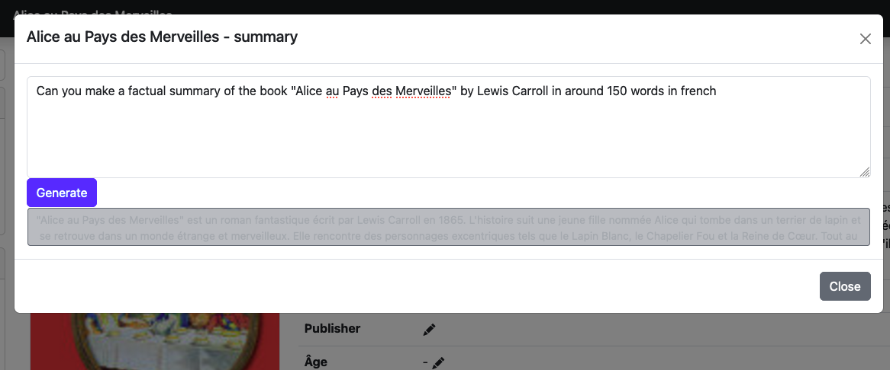
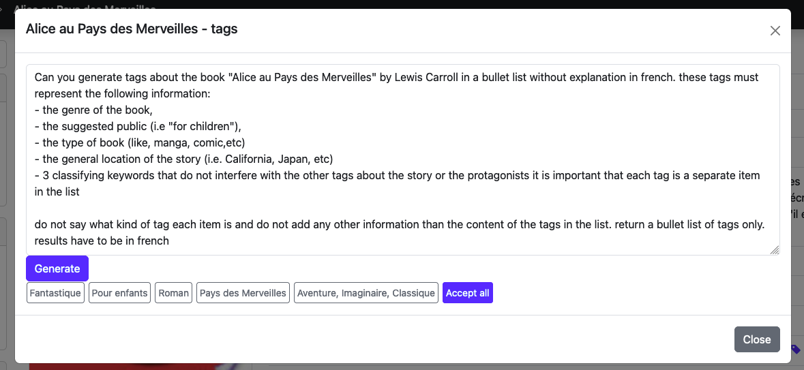

In your profile, you will be able to set up your OpenAI API key. This key is used to generate summaries of books and articles.

Please refer to OpenAI's documentation to get your API key.

If no key is set, the features will not be displayed in the application.

When your key is set, fill in the prompts that will be used to generate the summaries and tags.

The application will replace the `{book}` placeholder with the book's title, author and series.

## For tags
>  Can you give 5 classifying keywords about the book {book} in a list without explanation in french

## For summaries
>  Can you make a factual summary of the book {book} in around 150 words in french

## Examples

