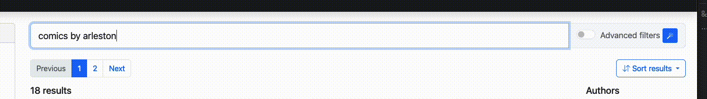

There are several ways to search for books in the library.

## Quick search
On top of every page, you can find a search bar. You can search for books by title, author, series, or tags. 
The search is case-insensitive and will return all books that match the search query.

This is mostly useful when you know what you are looking for and want to find it quickly.

## Filtering
In the search bar, you can click on advanced filters, which will allow you to write a typesense filter query.
The documentation for filtering typesense queries can be found here: https://typesense.org/docs/27.1/api/search.html#filter-parameters

If AI features are enabled, you can also write a natural language query and ask AI to convert it to filters by clicking the magic wand button:

